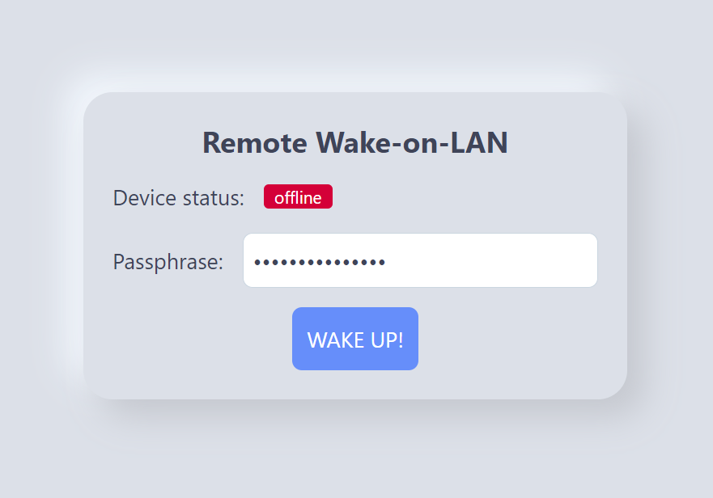

# Remote Wake-on-LAN with Rust and Leptos

[](https://github.com/beeb/remote-wol-rs/actions/workflows/build.yml)
[](https://github.com/beeb/remote-wol-rs/actions/workflows/docker.yml)

A self-contained, single-binary Rust and [Leptos](https://github.com/leptos-rs/leptos) application serving a web
interface to wake another device on the network through its ethernet adapter using Wake-on-LAN magic packets.



```
A utility to wake up a local computer remotely using a web interface.

Usage: remote_wol [OPTIONS]

Options:
  -m, --mac <MAC_ADDRESS>  The MAC address of the device to wake up
  -i, --ip <IP_ADDRESS>    The IP of the device to wake up (for monitoring)
  -p, --pass <PASSPHRASE>  The passphrase to use to wake up the device
      --port <PORT>        The local port used to serve the web app [default: 3000]
      --host               Expose the web app to the local network
  -h, --help               Print help
  -V, --version            Print version
```

## Quick start

The binary expects at least 2 arguments:

- the MAC address of the device to wake up
- the passphrase that will protect this interface from unauthorized use
- (optional) the local IP address of the device to wake up, for monitoring its upstate.
- (optional) the port where the web interface will be served (default: 3000)
- (optional) whether to run the interface on `0.0.0.0` (accessible on the local network) or
  `127.0.0.1` (only on the loopback interface)

```bash
remote_wol -m 01:02:03:04:05:06 -p your_l0ng_but_easy_to_remember_passphrase -i 192.168.0.123 --host
```

Alternatively, those parameters can be provided with environment variables,
even using a `.env` file in the same directory:

- `WOL_MAC_ADDRESS`
- `WOL_PASSPHRASE`
- `WOL_IP_ADDRESS`
- `WOL_PORT`
- `WOL_HOST`: e.g. `0.0.0.0` (expose to local network) or `127.0.0.1` (only on the loopback interface)

### About permissions

In order for this binary to ping the target device, special permissions are required on linux and macOS.

For linux, you can add (once) the `cap_net_raw` capability flag to the binary (requires root) and then use it later in
user space.

```bash
sudo setcap 'cap_net_raw+epi' ./remote_wol
# new session, can be used as user
./remote_wol [OPTIONS]
```

For macOS, you probably need to run the binary as root to enable the ping to work:

```bash
sudo ./remote_wol [OPTIONS]
```

On Windows, ping should work out of the box.

## Using Docker

The application is available as a [docker image](https://hub.docker.com/r/vbersier/remote-wol-rs).

```bash
docker run --network="host" -d vbersier/remote-wol-rs:latest -m 01:02:03:04:05:06 \
-p your_l0ng_but_easy_to_remember_passphrase -i 192.168.0.123 --host
```

### Example using docker-compose

```yaml
services:
  wol:
    image: vbersier/remote-wol-rs:latest
    restart: unless-stopped
    # host mode is needed for UDP broadcast
    network_mode: host
    environment:
      WOL_IP_ADDRESS: '192.168.0.123'
      WOL_MAC_ADDRESS: 01:02:03:04:05:06
      WOL_PASSPHRASE: your_l0ng_but_easy_to_remember_passphrase
      WOL_HOST: '0.0.0.0'
```

## Accessing from the internet

This web interface is not automatically accessible through the internet. You could, for instance, forward port `3000` in
your firewall to the device running `remote-wol-rs`, and then accessing it through its public IP.

You could also use a dynDNS service to have a domain name always pointing to your device's public IP.

Finally, you could use something like [Cloudflare Tunnel](https://developers.cloudflare.com/cloudflare-one/connections/connect-apps/)
to setup a permanent tunnel to your local webserver through a custom domain.

## Building from source

To build your own executable, you need to install the rust `nightly` toolchain and `wasm32-unknown-unknown` target:

```bash
rustup toolchain install nightly
rustup +nightly target add wasm32-unknown-unknown
```

As a pre-build step, you need to compile the CSS using [`tailwindcss`](https://tailwindcss.com/docs/installation):

```bash
tailwindcss -i style/input.css -o style/output.css --minify
```

Then, you probably should use the `cargo-leptos` utility:

```bash
cargo install cargo-leptos
cargo leptos build --release
```

Finally, in order for the resulting self-contained binary (`target/server/release/remote_wol`) to be able to send
ping requests, you need to either run it as root, or if you system supports capabilitity flags, to add the `cap_net_raw`
capability like below:

```bash
sudo setcap 'cap_net_raw+epi' ./target/server/release/remote_wol
```

## Credits

This application relies heavily on [`wol-rs`](https://github.com/fengyc/wol-rs) and
[`Leptos`](https://github.com/leptos-rs/leptos) for its core functionality. Thank you to their respective authors and
maintainers!
